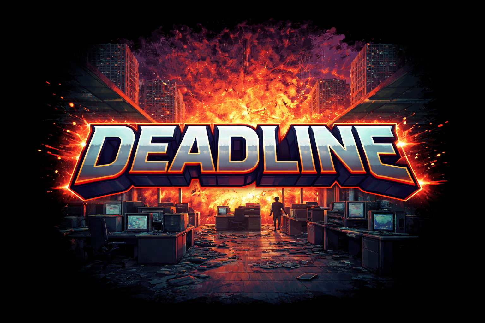

# DEADLINE



An 8-bit competitive maze racer where you descend a collapsing office building floor-by-floor, racing AI opponents to corner exits before each level implodes.

## Play Now

Open `index.html` in a browser or run the dev server:

```bash
npm install
npm start
```

Then visit http://localhost:3000

## Game Modes

- **Standard Run** - 13 floors of corporate chaos
- **Quick Run** - 7 floors for shorter sessions
- **Endless Mode** - Infinite descent with increasing difficulty
- **Daily Challenge** - Seeded daily mazes with local leaderboards

## Controls

- **Arrow Keys / WASD** - Move
- **Space** - Use power-up
- **P** - Pause
- **R** - Quick restart

## Difficulty Levels

- **Zen** - No timer, no enemies (explore freely)
- **Chill** - Relaxed pace, fewer enemies
- **Normal** - The intended experience
- **Intense** - More enemies, less time
- **Crunch** - Maximum chaos

---

*Just trying to survive another day at the office.*
